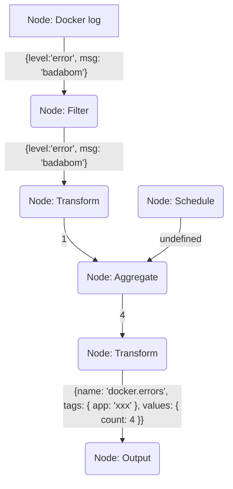
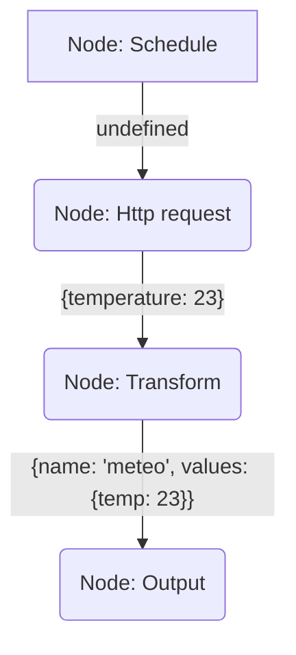

# metrics-collector

Metrics collector like Telegraf with node-red like logic

First development only for my needs, and will see how to design it

Idea : Like node-red, having nodes triggered by events (schedule, fs, api) or called by others nodes ; to see

First Idea : collects scheduled with jsonata handles, that output metrics (interface) that will be converted (influxdb, http, etc)

```javascript
const collects = [
    {
        name: 'tasks',
        schedule: '5 minutes',
        // target
        handle: `
            (
                $tasks := $http({
                    "url": "https://jsonplaceholder.typicode.com/todos",
                    "responseType": "json"
                });

                $countedBy := $tasks {
                    $string(userId) : {
                        "nbCmpleted": $[completed=true] ~> $count(),
                        "nbTodo":  $[completed=false] ~> $count(),
                        "nbTotal": $ ~> $count()
                    }
                };

                $map($countedBy ~> $spread(), function ($v) {
                    {
                        "tags": {
                            "userId": $number($keys($v))
                        },
                        "values": $lookup($v, $keys($v))
                    }
                })
            )
        `,
        target: 'main'
    },
    {
        name: 'dockerLogs',
        schedule: '5 minutes',
        handle: `
            {
                "measurement": "nbQuotations",
                "tags": {
                    "hostname": "any"
                },
                "values": {
                    "count": $dockerLogs()[$contains(log, '/quotation')] ~> $count()
                }
            }
        `,
        target: 'main'
    },
    {
        name: 'dockerLogs2',
        schedule: '5 minutes',
        handle: `
            {
                "measurement": "nbQuotations",
                "tags": {
                    "hostname": "any"
                },
                "values": {
                    "count": $dockerLogs({
                        "filter": function($log) { $contains($log.log, '/quotation') }
                    }) ~> $count()
                }
            }
        `,
        target: 'main'
    }

]
```


[](https://mermaid.live/edit#pako:eNqNUstu2zAQ_BWCF9WAYtePOgkPBZIo7qntIblFPazJFUWED4EiHQey_r3UA7kFCE_k7MzsLnc7yp1Aymil3RuvwQfyXJSWpHP38ieFGCkcf0VPtJP_yNXVz0tJO40n1CxD753PcmJayUh2BAFHZ7K-pBdy_20SH5QO6BeT4_3X9Q-z_tmDbSvnzWzxMFusB1Ixk-6k9Cgh4Ex6nPEnXqOIGhejKFqBlbIoknDiFQNOLrsLOXyS7jAxUskWTIpnYvyM5Vh5m0oPIFtGOgJNk6Ln8zkjfU5OoCOOOHfRBkZ2pB_b-jXn-RtDE8OC5tSgN6BEmkA3pCxpqNFgSVm6pnoh6lDS0vaJCjG4p3fLKQs-Yk5jI1LPhQLpwVBWgW4_0EehgvMfoHYgMD07Gt6bYdxStSFZcmcrJQc8ep3gOoSmZavVEF5KFep4XHJnVq0Sw27Up9v9ar_Z38Bmi_vrLfzYbgU_rm9vqs1uXYnr7-sN0L7PKY75f0-7Na5Y_x_aNsZr)



[](https://mermaid.live/edit#pako:eNpNkc1OwzAQhF_F2gsg9YcmkLY5INEWwQU40Bvm4MabxlJsB2ddVKV5d5ykVPhkz8589q4byKxESCEv7U9WCEdsu-GGhfX4-RZKKXshqpgylacvNh4_nLyRmCuD8sRW1_8sDr891nQzpFe9l0NDqCt0grwLxihuOZzY-pzbOmHq3Dp9Dq3_QkboUL7SSGivRuwgyoBOWQ_rKT3m-Yx59xReNzAGEDfcwAg0Oi2UDO01nc6BCtTIIQ3b0ITwJXHgpg1W4cl-HE0GKTmPI_CVFIQbJfZOaEhzUdYX9Ukqsu4illZIDMcG6Fh1s9yrmgIysyZX-073rgxyEaZUp9NpV57sFRV-N8msntZKdoMvDstkmkTJQkQxJvNY3MexzHaz5SKP7ma5nN_OIgFtOwLs738dPq7_v_YXxpeU1w)

